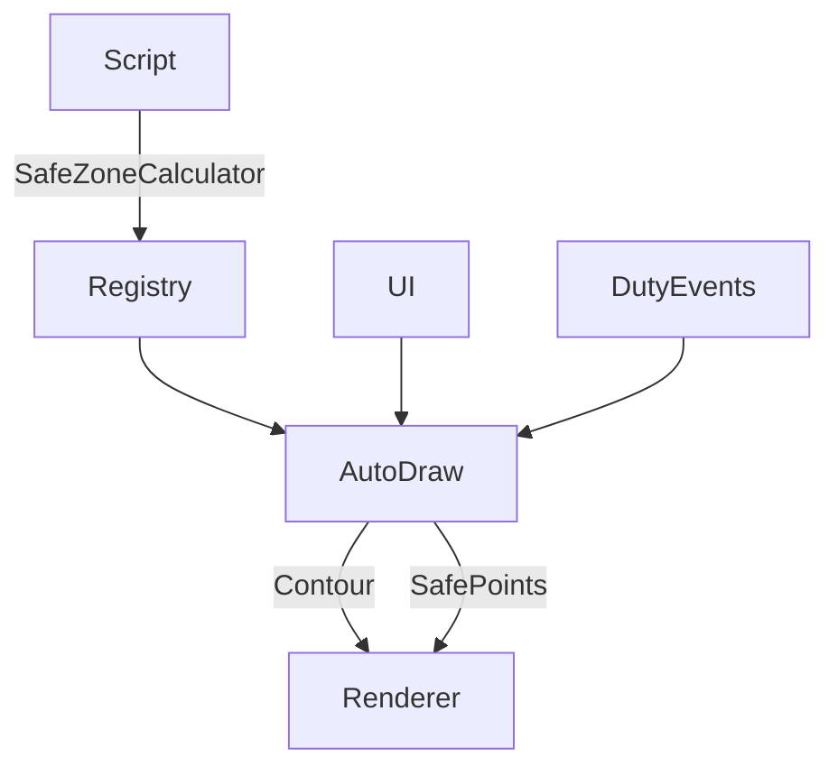

# 变更提案: auto-draw-distancefield

## 元信息
```yaml
类型: 新功能
方案类型: implementation
优先级: P1
状态: 草稿
创建: 2026-02-06
```

---

## 1. 需求

### 背景
现有危险区绘制仅支持 UI 内手动添加 AOEShape 列表，脚本中使用 SafeZoneCalculator/ForbiddenZone 进行计算时不会自动绘制，导致调试与使用成本高。

### 目标
- 脚本仅使用 SafeZoneCalculator 的 SetArenaBounds/AddForbiddenZone/FindSafePositions 即可自动绘制
- 支持所有 DistanceField 形状
- UI 提供统一开关（危险区域 & 几何计算页各一处），显示当前图形数量与一键清空
- 副本重置场景（换副本/返回城镇、灭团重置、Boss 重置、重新进入副本）自动清理
- 安全点仅在调用 FindSafePositions 时绘制

### 约束条件
```yaml
时间约束: 无
性能约束: 需可控的采样分辨率，避免影响帧率
兼容性约束: 不要求脚本额外调用绘制 API
业务约束: Activation 时间作为危险区激活门槛
```

### 验收标准
- [ ] 脚本仅调用 SafeZoneCalculator 即可自动绘制（无需额外绘制代码）
- [ ] DistanceField 全形状可渲染（至少在场地范围内）
- [ ] UI 开关可控制自动绘制开关，显示数量并支持清空
- [ ] 副本重置场景触发清理（DutyWiped/DutyCompleted/离开副本/重新进入/战斗计时重置）
- [ ] 安全点仅在 FindSafePositions 执行后绘制

---

## 2. 方案

### 技术方案
引入“SafeZone 自动绘制服务”并在 SafeZoneCalculator 内部注册实例：
- SafeZoneCalculator 构造时加入注册表（弱引用），不要求脚本做额外调用
- SafePositionQuery.Execute 在产生安全点后发出通知
- SafeZoneAutoDraw 订阅注册表与通知，通过 DistanceField 等值线（marching squares）渲染危险区轮廓，并在需要时绘制安全点
- 统一 Overlay 管理，保证 AOE 绘制与 SafeZone 绘制共享同一渲染器
- 通过 Duty 事件与副本状态变化触发自动清理

### 影响范围
```yaml
涉及模块:
  - AOESafetyCalculator: 注册表/通知/安全点回调
  - Rendering: 自动绘制服务、距离场轮廓绘制
  - UI: 危险区域/几何计算页开关与清空
  - Settings: 新增 SafeZone 绘制设置
预计变更文件: 8-12
```

### 风险评估
| 风险 | 等级 | 应对 |
|------|------|------|
| 轮廓采样性能开销 | 中 | 设定默认采样步长，必要时提供配置 |
| 形状无场地时的可视范围不足 | 低 | 使用场地边界优先，无场地时使用默认范围 |
| 渲染器开启导致 DebugPoint 也显示 | 低 | 保持现状，必要时后续增加独立开关 |

---

## 3. 技术设计（可选）

### 架构设计


---

## 4. 核心场景

### 场景: 脚本自动绘制危险区
**模块**: SafeZoneAutoDraw
**条件**: UI 开关开启，SafeZoneCalculator 添加 ForbiddenZone
**行为**: 轮廓渲染危险区图形
**结果**: 游戏画面显示危险区轮廓

### 场景: FindSafePositions 触发安全点绘制
**模块**: SafePositionQuery
**条件**: 脚本调用 Execute 并产生安全点
**行为**: 触发通知并绘制安全点
**结果**: 画面出现安全点标记

---

## 5. 技术决策

### auto-draw-distancefield#D001: 距离场轮廓渲染
**日期**: 2026-02-06
**状态**: ✅采纳
**背景**: 脚本使用 ShapeDistance，无法映射为 AOEShape 列表
**选项分析**:
| 选项 | 优点 | 缺点 |
|------|------|------|
| A: 轮廓采样渲染 | 支持所有 DistanceField，脚本零改动 | 需要采样算法与性能控制 |
| B: 强制 AOEShape | 实现简单 | 违背“脚本零改动”，无法支持所有形状 |
**决策**: 选择方案A
**理由**: 满足“脚本零改动 + 全形状支持”的核心目标
**影响**: Rendering、AOESafetyCalculator、UI、Settings
